# 东南大学操作系统实践1 （张竞慧教授班）
实际上是一个进程隐藏的Project，本身难度不高，涉及编译内核，比较麻烦
## 实验环境
* ubuntu 22.0.4
* vmware
## 实验过程
下载内核并解压到 /usr/src 下

我们可以看到 linux-6.6.4 即是解压出的源码

进入新内核增加系统调用
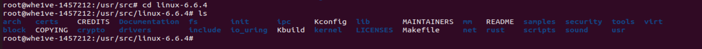
**编辑系统调用表**

 首先进入系统调用表所在目录
 ```
cd arch/x86/entry/syscalls
 ```
然后进入系统调用表添加上我们的两个系统调用
```
sudo vim syscalls_64.tbl
```
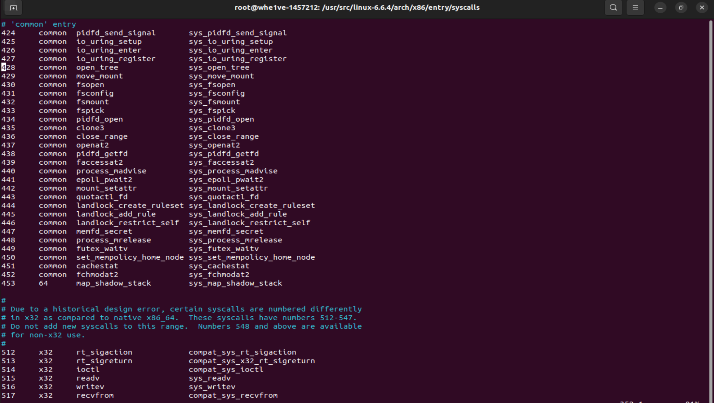
这里要注意将添加的系统调用添加到453后，蓝字其实已经说明原因
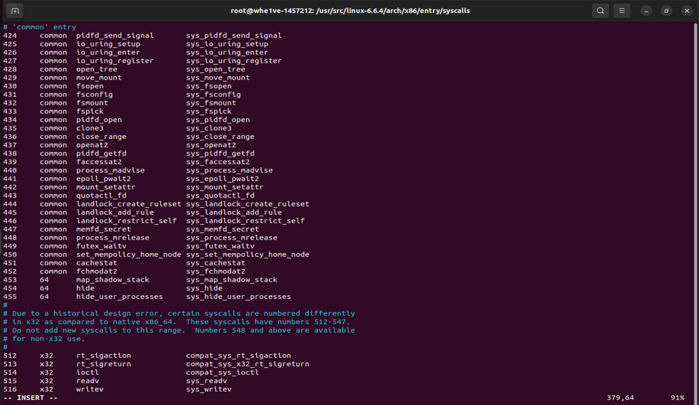

**修改unistd.h**
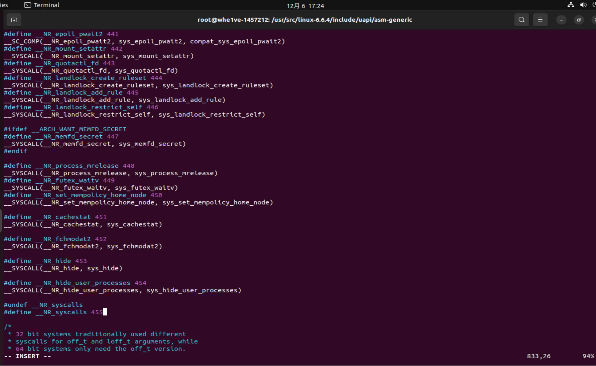
**紧接着是添加系统调用的声明**

进入所在目录
```
cd include/linux
```
修改系统调用声明文件
```
sudo vim syscalls.h
```
添加到最后即可
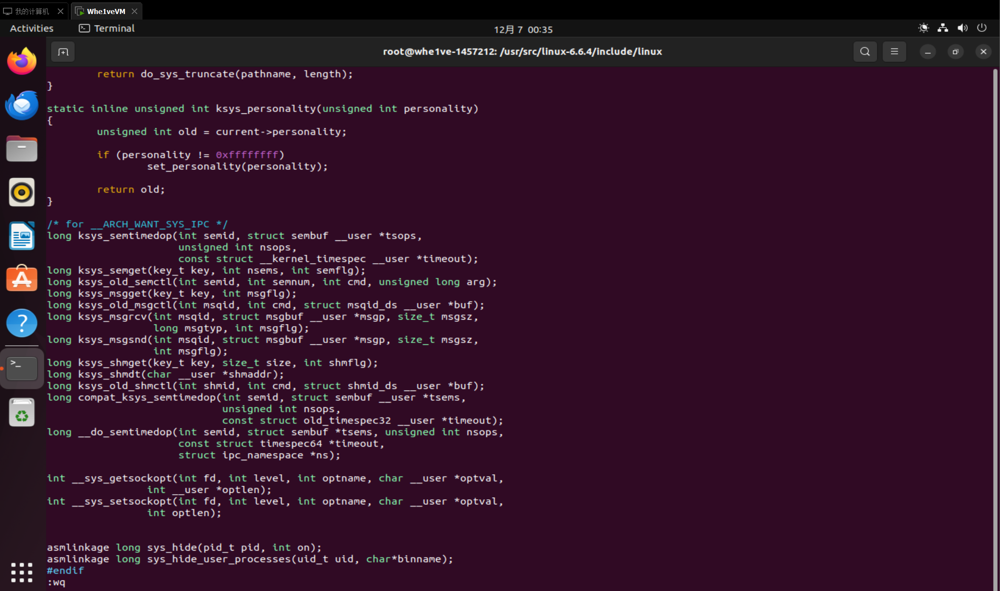
**然后是实现两个系统调用的具体定义**
同样先进入所在目录
```
cd kernel
```
然后在末尾写入系统调用定义
```
sudo vim sys.c
```
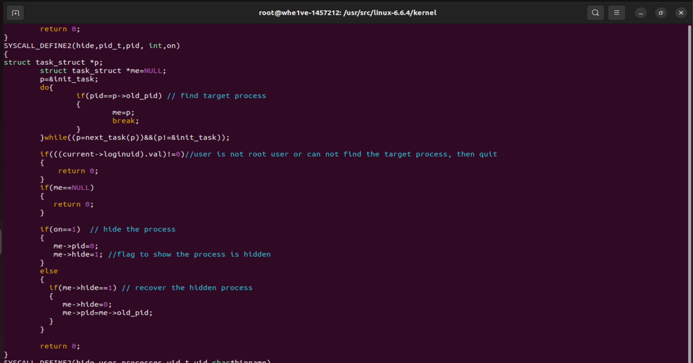
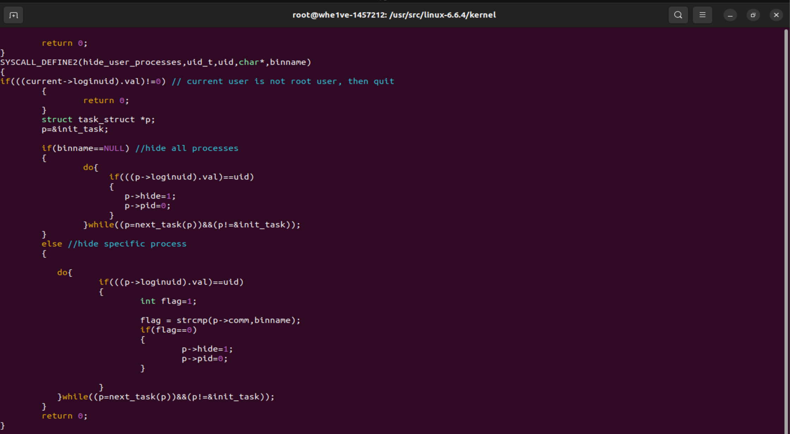
这里要注意前缀要加上***asmlinkage***  强迫参数全部从堆栈中读取，防止从寄存器中读取导致编译优化过程中影响传参过程
**然后是在sche.h中 task_struct的定义的末尾加上hide 以及old_pid的定义**

先进入目标目录
```
cd include/linux
```
然后添加定义
```
sudo vim sched.h
```
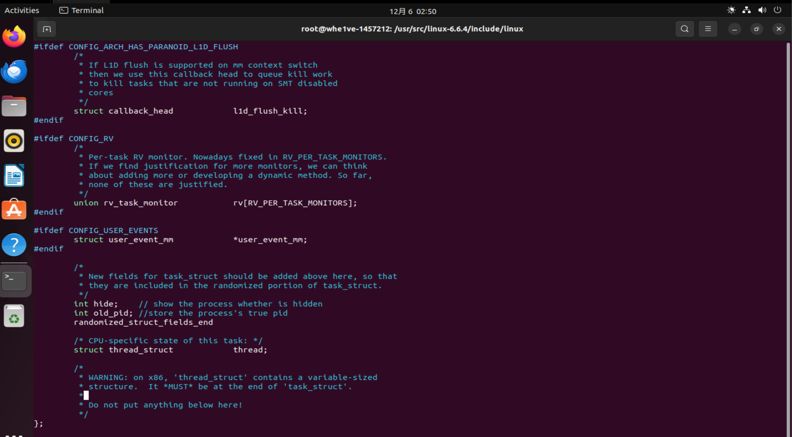
这里按照他的要求写以以满足 randomized_struct_fields_end的要求 使结构体对齐某个边界，增强安全性

**接着是fork.c的补充**
首先进入目标目录
```
cd kernel
```
在进入文件修改之前，可以先查询一下 copy_process在哪一行
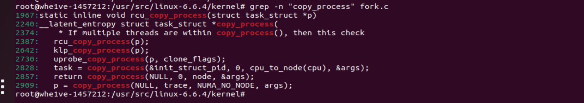
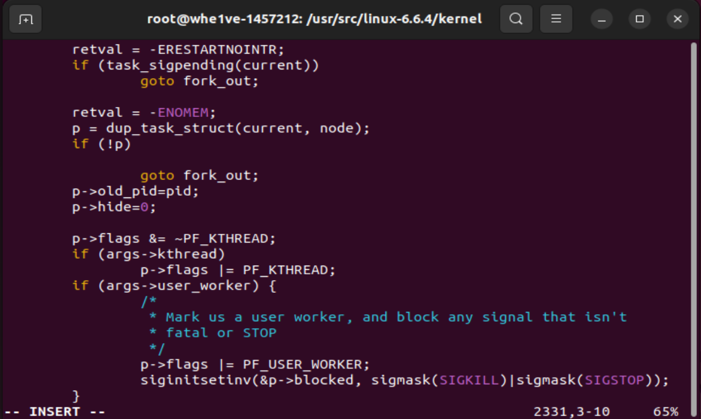


**接下来编译内核**

```
make mrproper //将编译生成的文件删除
make oldconfig //将当前系统应用的内核配置应用到新内核中
```
然后将.config文件中的两行内容置空
```
CONFIG_SYSTEM_TRUSTED_KEYS=""
CONFIG_SYSTEM_REVOCATION_KEYS=""
```
接下来重新编译整个内核
```
make all -j4 //4为线程数，这点要根据实际硬件处理器核数来调整以加速编译
```
接下来将编译好的内核安装到指定目录
```
make modules_install
```
接下来将编译生成的内核安装到系统中
```
make install
```
紧接着reboot即可使用新内核了

查看内核版本
```
uname -r
```
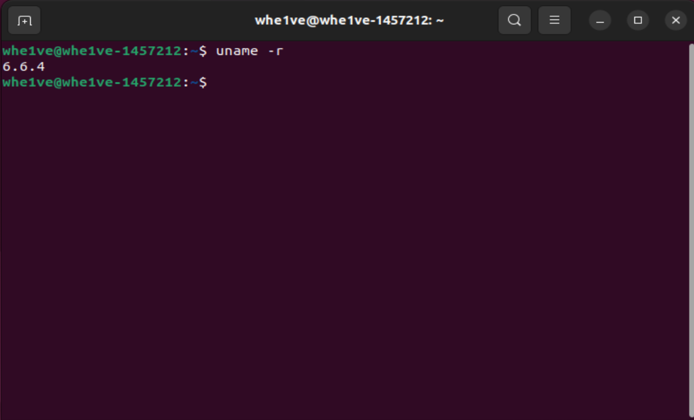
符合预期，则内核编译成功

**紧接着是测试程序**
hide.c
```
#include<sys/syscall.h>
#include<linux/unistd.h>
#include<stdio.h>
#define __NR_hide 453
int main(int argc,char*argv[]){
    syscall(__NR_hide, atoi(argv[1]), 1); // hide the process whose pid is argv[1]
    return 0;
}
```
功能是隐藏进程号为argv[1]的进程
recover.c
```
#include<sys/syscall.h>
#include<linux/unistd.h>
#include<stdio.h>
#define __NR_hide 453
int main(int argc,char*argv[]){
    syscall(__NR_hide, atoi(argv[1]), 0);
    return 0;
}
```
功能是恢复已隐藏进程号为argv[1]的进程

hideall.c
```
#include<sys/syscall.h>
#include<linux/unistd.h>
#include<stddef.h>
#define __NR_hide_user_processes 454
int main(int argc,char*argv[]){
    syscall(__NR_hide_user_processes, atoi(argv[1]), NULL);
    return 0;
}
```
功能是隐藏uid 为argv[1]的全部进程
hideUserProcess.c
```
#include<sys/syscall.h>
#include<linux/unistd.h>
#include<stddef.h>
#define __NR_hide_user_processes 454
int main(int argc,char*argv[]){
    syscall(__NR_hide_user_processes, atoi(argv[1]), argv[2]);
    return 0;
}
```
功能为隐藏uid为 argv[1]用户的 argv[2]进程
**实验过程**
首先是非root用户hide的测试
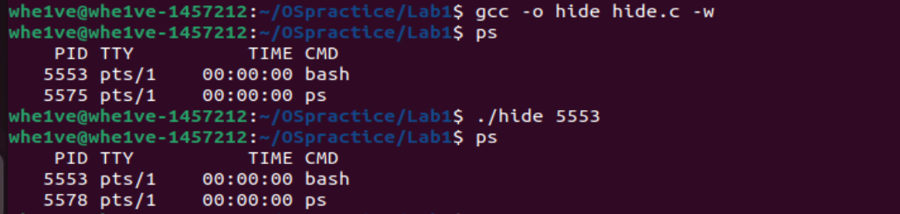
我们可以发现它并不可以隐藏进程
接着获得root权限，成为root用户后，隐藏1983号进程，发现可以隐藏

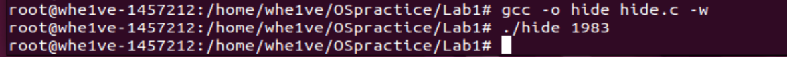
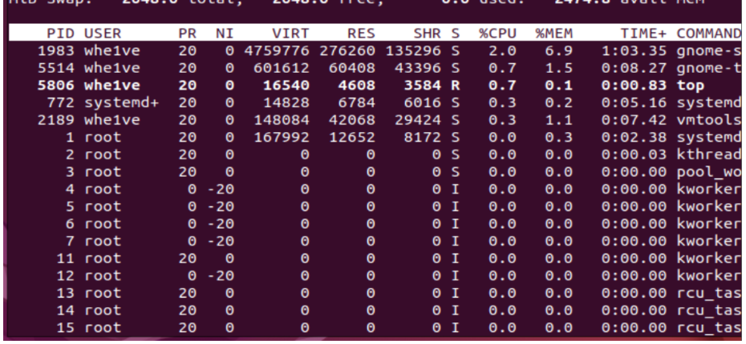
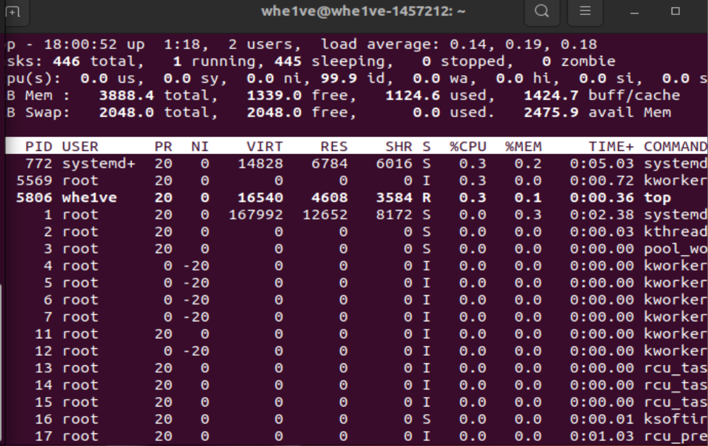
隐藏后我们进行recover

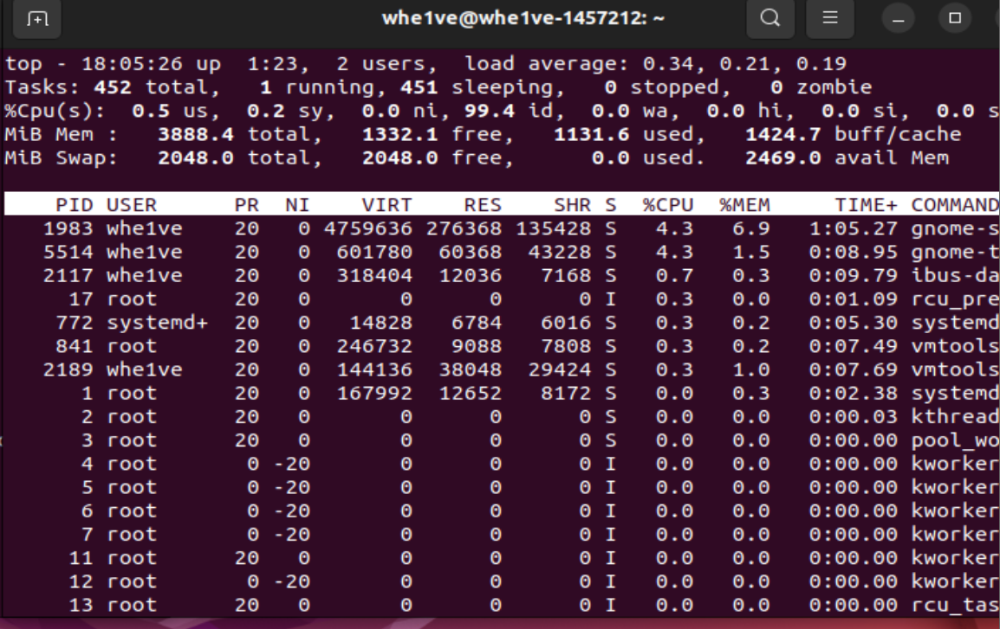
发现成功恢复
使用id查看用户的uid
```
id
```


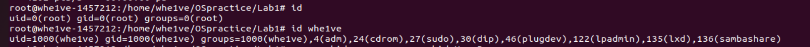
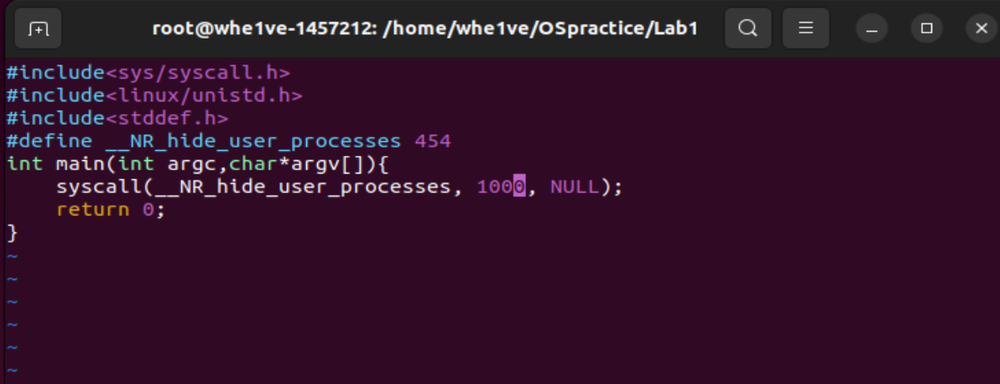
运行hideall发现全部成功隐藏
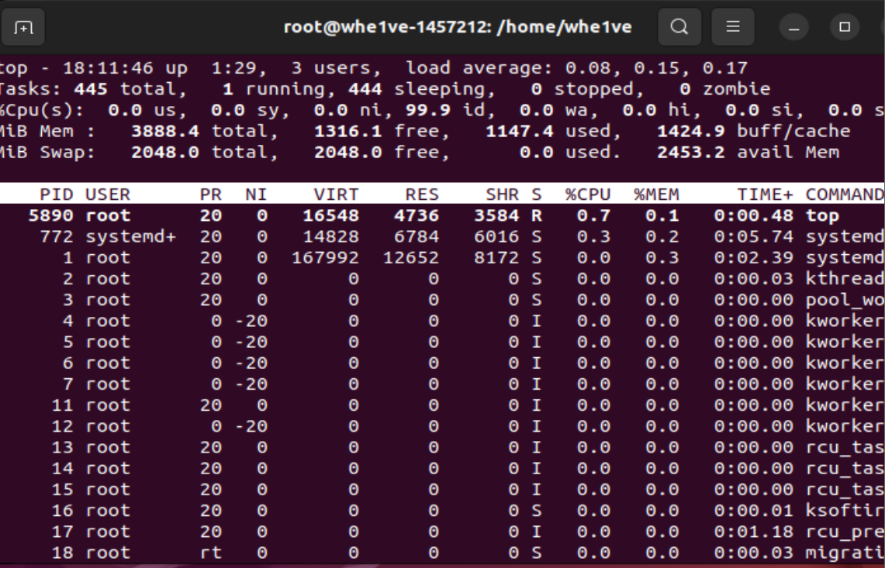
退出root用户运行hideall
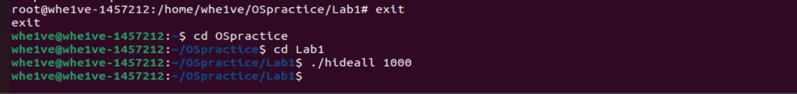
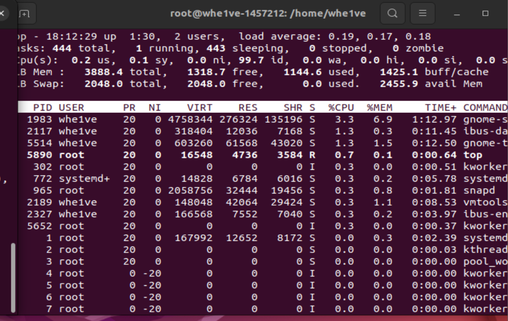
发现不能隐藏用户全部进程，则实验基本成功